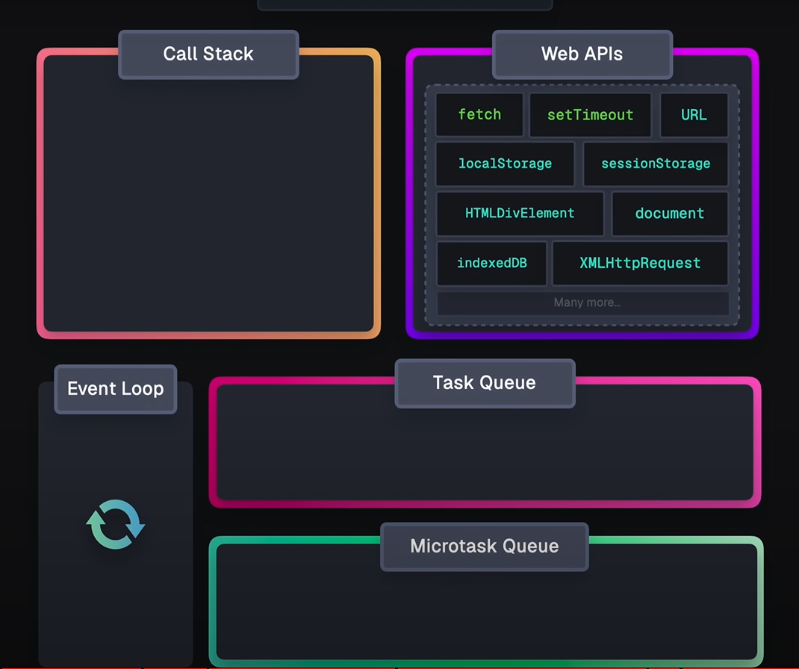
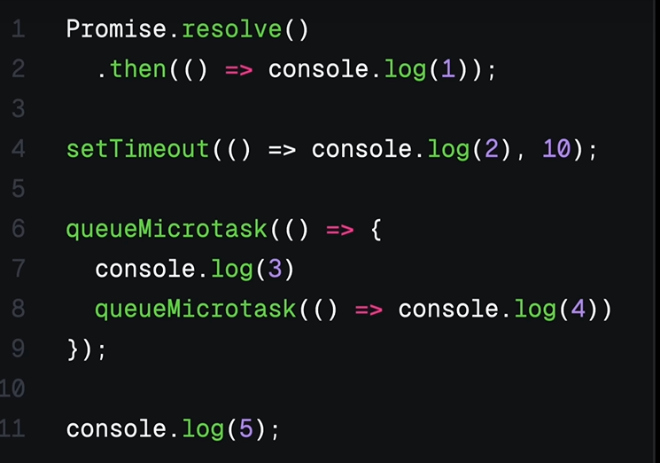

# crash-course_js-visualized

[Youtube Link](https://www.youtube.com/watch?v=eiC58R16hb8)

## JS Components

- Components:

  - Event Loop
  - Call Stack
  - Specifically it's the JS engine, which has the Call Stack and the Memory Heap, but let's make it simpler calling it call stack
  - Web APIs
  - Task Queue
  - Microtask Queue

  

- All of these components let JS work with async tasks in a non-blocking way

### Call Stack

- The Call Stack manages the execution of a program (in a linear way)

### Single Threaded Problem

- So, when we have a heavy processment (such as a loop) it will makes our application to take it's time

- And in real life applications, we don't want to block our application while another function is running

### Web APIs and CallBack based APIs

- Web APIs provide interfaces that allows to interact with browsers features, such as:

  - DOM
  - fetch
  - timers
  - localStorage
  - etc

- IN a web API, we can fetch some data (async task), such as ask geolocation, so we can be working with callbacks or promises

- Or we can wait for an event (such as the user click in allow permission)

### Task Queue (also called callback queue)

- The async task (which in our case is waiting a response or an user event) will be pushed to the task queue

- It holds all he callbacks and event handlers to wait to be ran

- So, the **Event Loop** is responsible for checking if the Call Stack is Empty and for Checking the There's something in the Task Queue that shoud be pushed to the Call Stack

### SetTimeout - e.g.

- In the Call Stack, we encounter a setTimeout
- So, the browser handle the timers;
- When the timer is done, the setTimeout callback (what should happen) is moved to the task queue, which is verified for the Event loop afer the Call Stack is empty
- So the Event Loop pushes it to the Call Stack, which runs it

- Note that the delay is not that the function will be moved to the Call Stack, the delay is for moving to the Task Queue

### Promises and microTask Queue

- When we Work with promises we work with the microtask queue

- MicroTask Queue is responsible for:

  - .then() / catch() functions
  - async / await functoins
  - queueMicrotask(()=>{...})
  - new MutationObserver(() => {...})

- **Event Loop prioritizes Microtask Queue and Then it goes to the Task Queue**

### Promise Example:

```
fetch(someUrl).then((res) => {
    console.log(res)
    })

console.log('End of Script')
```

1. fetch() goes to the Call Stack
2. It creates a Promise Object, which will be handled in the Web API
   - PromiseState = "pending"
   - PromiseResult = undefined
   - PromiseFulfillReaction = null
3. Now it gets the then callback function, which will create the PromiseReaction
4. Logs "End of Script"
5. Server returns data
   - PromiseState = "fulfilled"
   - PromiseResult = Response
   - PromiseReaction is moved to the Microtask Queue
6. Event Loop pushes the microtask queue (with the PromiseReaction) to the Call Stack

- We can also "promisify" a callback (such as the geolocation) to prioritize it
  - instead of navigator.geolocation.getCurrentPosition((position => console.log(position)), (err) => console.log(err));
  - we can const getPosition () => new Promise(resolve, reject) => navigator.geolocation.getCurrentPosition(resolve, reject)
  - or async / await it

### Challenge:



- It logs 5,1,3,4,2

### Recap:

- JS will run the Call Stack Code,in a linear way
- It can interact with an asyncronous web api, which will run in the background (and will not block the application)
- So after the asyncronous task is done, it will be moved to the Task Queue or to the MicroTask Queue
  - Microtask if its a promise, async/await, queueMicrotask() and new OberserveMutation();
  - Task Queue if its a regular callback
- The Event Loop will check if the CallStack is empty, and if so, will get the next task from the Microtask Queue
- After the Microtask Queue is empty, it will get teh next task from the Task Queue
